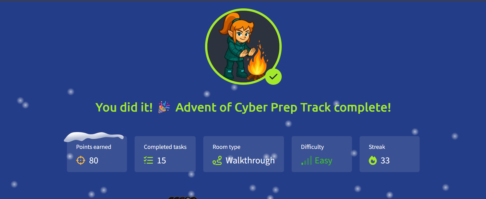

# 🎄 Advent of Cyber 2025 — Prep Track 

**Title:** Welcome to Advent of Cyber 2025  
**Date Completed:** Dec 2025  
**Difficulty:** Easy  
**Category:** Intro + Mini Challenges  
**Room Link:** https://tryhackme.com/room/adventofcyberpreptrack 
**Status:** ✔ Completed  

---

## 🧭 Overview
Prep Track introduces the Advent of Cyber 2025 event and walks through essential skills such as navigating TryHackMe, using the AttackBox, Linux/Windows basics, Wi-Fi concepts, and small security puzzles.

This day includes **10 mini-challenges**, each building a different cybersecurity skill.

---

# 🧩 Task-by-Task Write-Up

---

## **📝 Task 1 — Welcome to Advent of Cyber 2025**
A warm introduction explaining:
- Daily challenge format  
- How AoC improves cybersecurity skills  
- What participants can expect over the next 25 days  

No technical steps — just orientation.

---

## **🧭 Task 2 — How to Use TryHackMe**
Learned platform basics:
- Starting machines  
- Using in-browser AttackBox  
- Viewing learning paths  
- Submitting answers  

Simple navigation-focused walkthrough.

---

## **💬 Task 3 — Join Our Community**
Introduces the TryHackMe Discord community:
- Help channels  
- Beginner forums  
- Event announcements  
- Community discussions  

Not technical, but important for learning support.

---

## **📘 Task 4 — Introduction**
Explains that Prep Track will contain fun beginner challenges.  
This sets the stage for 10 micro-lessons covering:
- Password cracking basics  
- Malware clues  
- Command line  
- Linux  
- Wi-Fi  
- OSINT  
- Browser history  
… and more.

---

---

# 🎯 **CHALLENGE SECTION**

Below are the 10 hands-on challenges included in Prep Track.

---

## **🔐 Challenge 1 — Password Pandemonium**
Intro to password security:
- Identifying weak passwords  
- Understanding dictionary attacks  
- Basic password hygiene  

Answer required analyzing simple password clues.

---

## **🕵️ Challenge 2 — The Suspicious Chocolate.exe**
A fun intro to malware concepts:
- Recognizing suspicious executable names  
- Thinking like an analyst  
- Identifying risky file behavior  

The goal was to spot the malicious file.

---

## **💻 Challenge 3 — Welcome to the AttackBox!**
Learned:
- Starting the AttackBox  
- Connecting to challenge machines  
- Running basic commands  
- Where terminal results appear  

This is essential for future AoC challenges.

---

## **🛠 Challenge 4 — The CMD Conundrum**
Windows command-line basics:
- Using `dir`  
- Navigating folders  
- Viewing files  
- Solving a riddle using CMD  

Good warm-up for Windows fundamentals.

---

## **🐧 Challenge 5 — Linux Lore**
Linux basics refresher:
- `ls`, `cd`, `cat`, `pwd`  
- Understanding Linux directories  
- Reading file contents  

You solved a small puzzle by exploring the Linux system.

---

## **📜 Challenge 6 — The Leak in the List**
Small investigative puzzle:
- Searching files  
- Identifying a leak or hidden clue  
- Using either Windows or Linux tools  

Develops beginner investigation mindset.

---

## **📶 Challenge 7 — WiFi Woes in Wareville**
Learned essential Wi-Fi concepts:
- SSIDs  
- Routers  
- APs  
- Basic troubleshooting logic  

Fun scenario-based question.

---

## **📱 Challenge 8 — The App Trap**
Mobile security mini-lesson:
- Recognizing suspicious apps  
- Permissions awareness  
- Identifying red flags in app behavior  

Introduces mobile security thinking.

---

## **💬 Challenge 9 — The Chatbot Confession**
OSINT + chatbot interaction:
- Extracting clues from text  
- Following narrative hints  
- Understanding conversational analysis  

This puzzle uses logical reasoning.

---

## **🌐 Challenge 10 — The Bunny’s Browser Trail**
Browser history analysis:
- Reading web history  
- Following URLs  
- Identifying user activity  
- Tracing a digital footprint  

Great intro to forensic thinking.

---

# 📘 **What I Learned Today**
- How TryHackMe works  
- How to use AttackBox  
- Basic Windows and Linux terminal commands  
- Password hygiene concepts  
- Malware awareness basics  
- OSINT fundamentals  
- Browser forensic basics  
- Wi-Fi troubleshooting logic  
- How to approach cybersecurity puzzles logically  

---

# 🧠 **Key Takeaway**
> “Cybersecurity starts with curiosity — Prep track encourages exploring, asking questions, and solving small problems that build into real skills.”

---

# 🔜 Next Steps
Proceed to **Day 1** of Advent of Cyber 2025.

---

